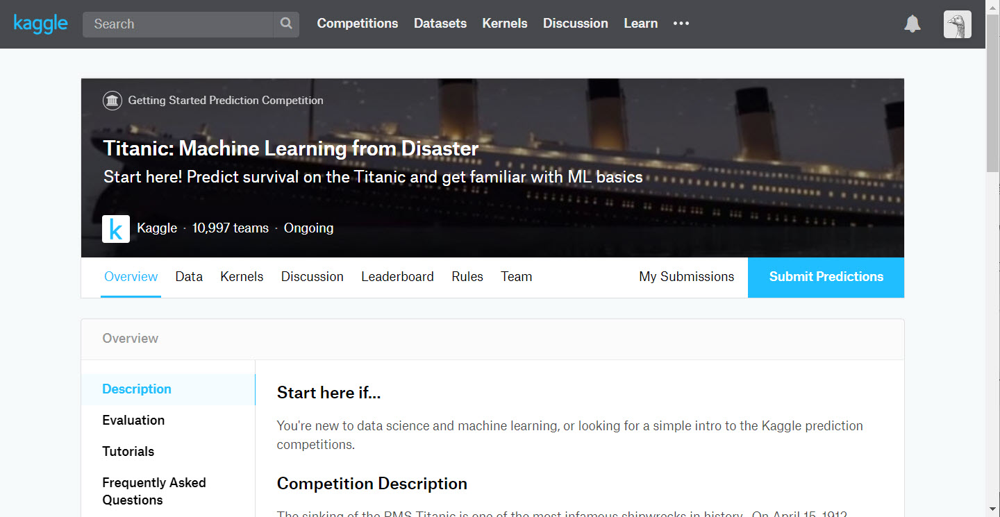
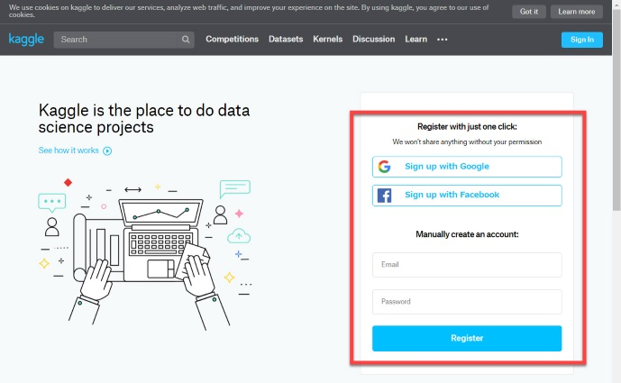
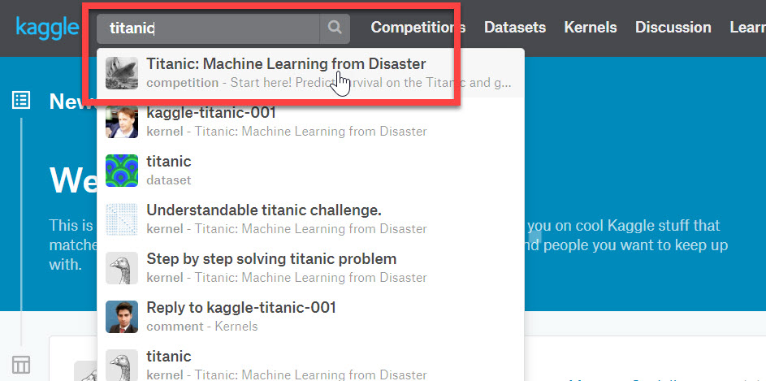
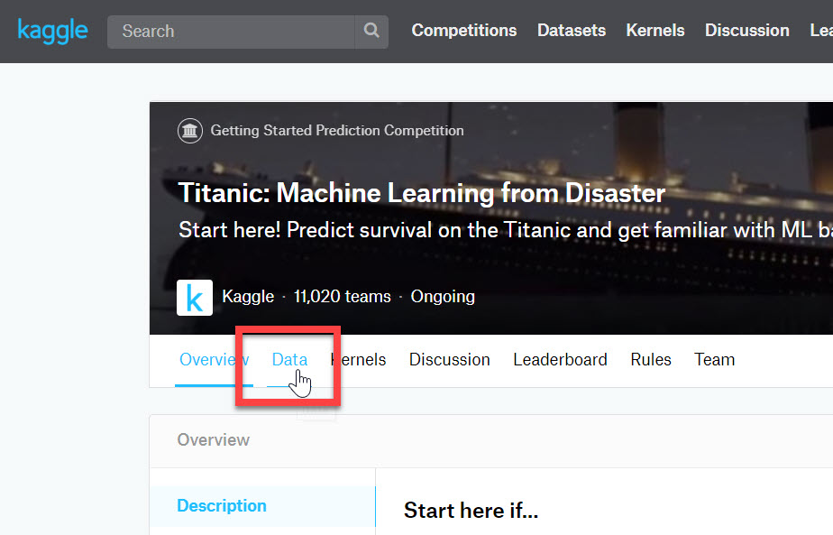
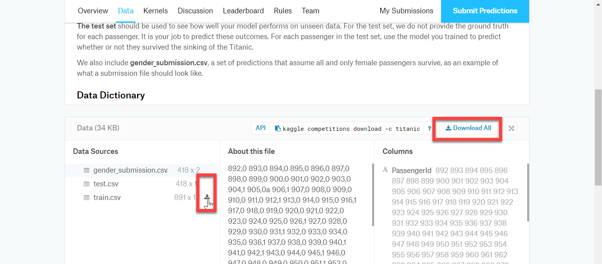

# データを用意する

機械学習には **データが大事** です。  
機械学習のフローの最初のステップとしてデータを用意します。  

今回は、データ分析に関するプラットフォーム（サイト）として有名な [**Kaggle**](https://www.kaggle.com/) で提供されているデータセットを使用します。

使用するデータセットは [**タイタニック号の乗船リスト**](https://www.kaggle.com/c/titanic) です。  
このデータセットを使って、**どのような属性の人が "助かる" か** を予測するモデルを作ります。

> [Kaggle](https://www.kaggle.com/) とは、データ分析に関するプラットフォームです。  
> いろいろなデータセットが用意され、そのデータセットを使った機械学習・深層学習のコンペが開催されることがあります。優秀なモデルの解説も掲載されています。  
> 機械学習を「学習」する際には便利なサイトです。無償のアカウント登録をすれば、データセットや機械学習に役立つ多くの知見を得られます。  
> [**Titanic**](https://www.kaggle.com/c/titanic) は、Kaggle の中でも有名なデータセットです。構造が簡単でサイズが小さいので、機械学習のフローを理解しやすい教材です。

---

## Kaggle に登録

> すでに Kaggle のアカウントを持っている場合は、この手順はスキップして、下の [データセットをダウンロード] に進んでください。

最初に Kaggle にアカウントを作ります。

1. [**Kaggle**](https://www.kaggle.com/) に接続します。
2. 表示されているいずれかの方法でアカウントを登録します。  
  

---

## データセットをダウンロード

今回使うデータセットを Kaggle からダウンロードします。

1. Kaggle にサインインし、検索ボックスに **titanic** と入力して少し待つと、検索結果が表示されます。"**Titanic: Machine Learning from Disaster**" を選択します。  

2. [Data] タブをクリックします。  

3. "train.csv" および "test.csv" をダウンロードします。"Download All" でまとめてダウンロードするか、ファイル名の行でマウスホバーしてダウンロードします。  

4. "Download All" でダウンロードした場合は、ZIP ファイルを展開します。
5. "train.csv" (学習するデータセット) をテキストエディターまたは Excel などで開いて、データを見てみます。

train.csv は以下の列で構成されます。  

|列名|定義|値|
|---|---|---|
|survival|助かったか|0 = 助かった, 1 = 助からなかった|
|pclass|客室の等級|1 = 一等, 2 = 二等, 3 = 三等|
|sex|性別|female, male|
|age|年齢| |
|sibsp|乗船した兄弟、配偶者の人数| |
|parch|乗船した親、子供の人数| |
|ticket|チケット番号| |
|fare|乗船料| |
|cabin|客室番号| |
|embarked|乗船した港|C = Cherbourg, Q = Queenstown, S = Southampton|

survival 以外の列の値から **survival 列を予測** するのが、今回の学習の目的です。  

> test.csv は学習済みモデルをテストするためのデータなので、"survival" 列はありません。このコンテンツの最後のステップで、発行した学習済みモデルを利用する際のデータとして使用します。

---

データを用意できたので、次から Azure Machine Learning Studio での作業に進みます。  
まずは Titanic のデータセットを Azure Machine Learning Studio にアップロードして、[**データの分析**](./02_dataanalyze.md) を行います。